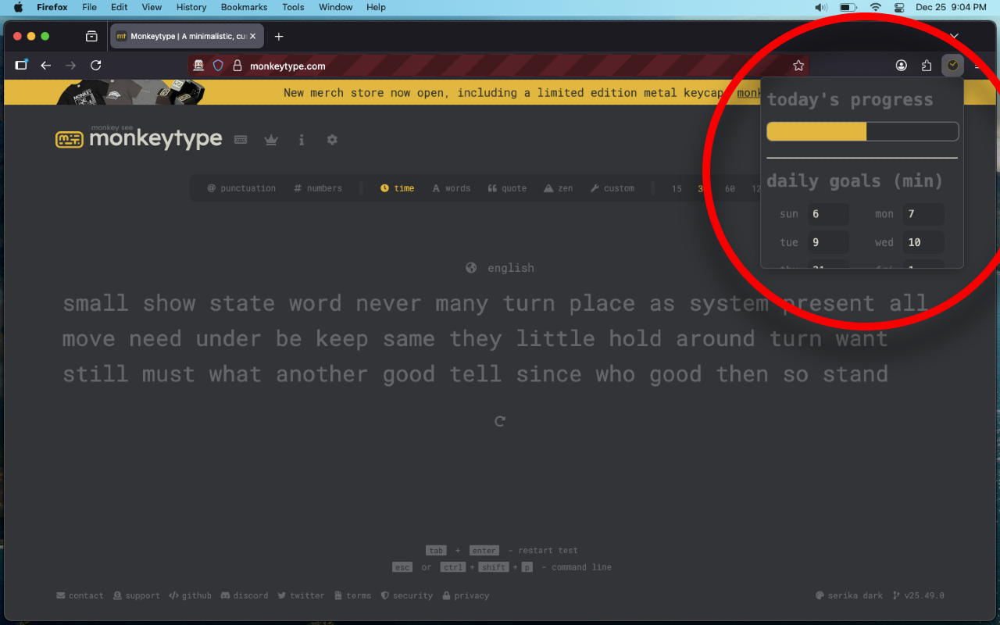

# Typing Goal Tracker 

A tool that helps Monkeytype users reach their daily typing goals. This 
project is not affiliated with Monkeytype.

---

## Development Setup

### Dependencies

- Install [Bun](https://bun.com/), this project's build tool and package manager. 
    - The version this project uses is `v1.3.14`
- Install [Typescript](https://www.typescriptlang.org/) and [Web-ext](https://github.com/mozilla/web-ext) as development dependencies with: `bun i`
    - Versions details can be found in `bun.lock` and `package.json`

### Scripts

- Lint the project's Manifest V3, `manifest.json`, with: `web-ext lint`
- Build the project with: `bun run build`
    - The build output of `src/` can be found in `dist/`
    - A `.zip` file encapsulating the extension can be found in `web-ext-artifacts/`
- Run the project using Firefox, with devtools enabled, with: `bun run dev`
    - To run the project using a browser forked from Firefox, like Zen, see 
    `package.json`

## Credits

- `assets/icon.svg`: made by Je m'apple (me)
- Extension theme inspiration: [Monkeytype](https://monkeytype.com)
- Time typed tracking logic: [Stack Overflow](https://stackoverflow.com/questions/29971898/how-to-create-an-accurate-timer-in-javascript)

## License

- MIT, find details [here](LICENSE.md)

